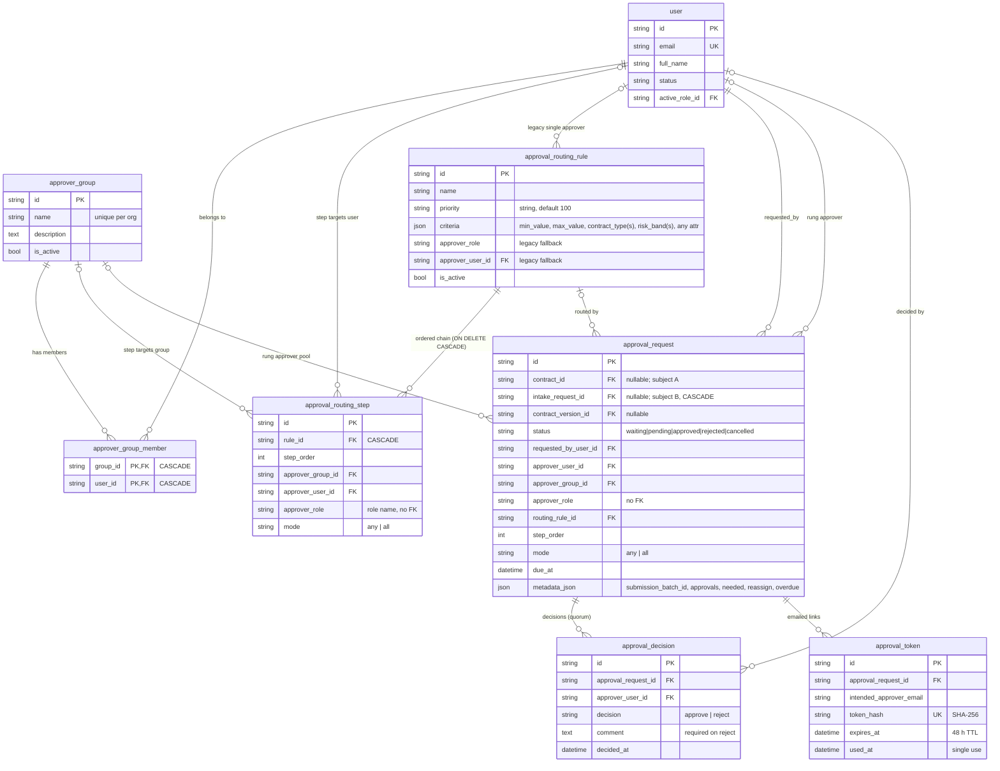
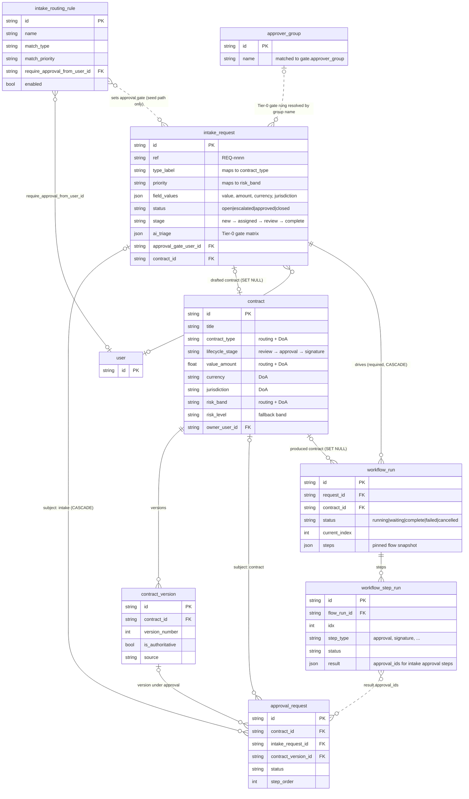
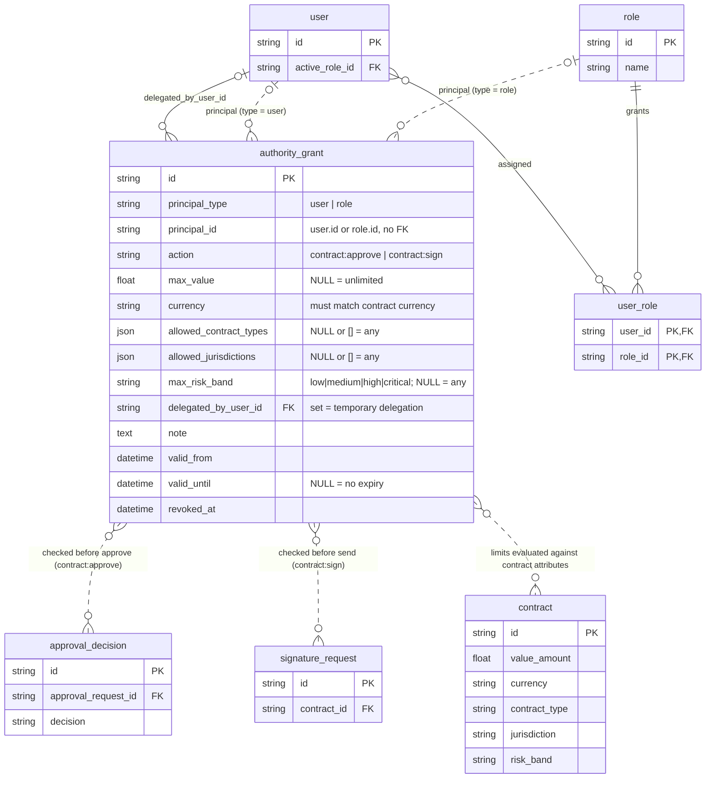
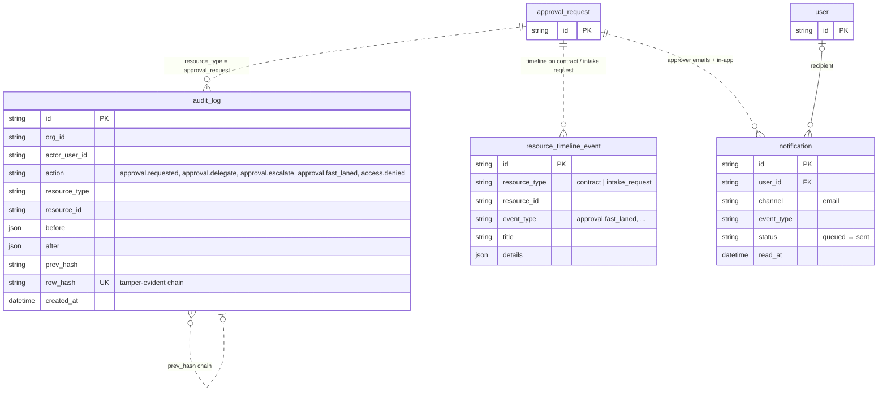

# AEGIS Approval Workflow — Entity-Relationship Diagrams

| | |
|---|---|
| **Scope** | Approval ladder (routing, chains, decisions, email tokens), Delegation of Authority, and the entities approvals attach to (contracts, intake requests, workflows) |
| **Baseline** | Branch `drl`, analysed 11 September 2026 |
| **Sources** | `backend/app/approvals/models.py`, `backend/app/authority/models.py`, `backend/app/intake/approval_bridge.py`, `backend/app/approvals/service.py`, migrations `0001`, `0009`, `0011`, `0021`, `0025`, `0027` |

### Reading the diagrams

- **Solid line (`--`)** = a real database foreign key.
- **Dashed line (`..`)** = a *logical* link held in application code (a string id, a JSON field, or `resource_type`/`resource_id`) with **no** foreign key in the database.
- Cardinality follows crow's-foot notation: `||` exactly one, `|o` zero or one, `}o` zero or many.
- Every table below (except the two association tables) also carries the standard mixin columns `org_id` (tenant scope, indexed, not an FK), `created_by_user_id`, `updated_by_user_id`, `created_at`, `updated_at`. They are omitted from the boxes to keep the diagrams readable.

---

## 1. Approval ladder — configuration and runtime

The core model. **Configuration** (groups, routing rules and their ordered steps) is defined by admins. **Runtime** rows are created when something is submitted for approval: one `approval_request` per rung, with its decisions and single-use email tokens.

#### How the ladder rows behave

| Column / rule | Behaviour | Evidence |
|---|---|---|
| One row per rung | A submission materialises the whole chain at once; all rungs share `metadata_json.submission_batch_id` | `approvals/service.py:581-622` |
| `status` progression | Rung 1 starts `pending` and is emailed; later rungs start `waiting` and become `pending` in `step_order` as each prior rung is approved. A reject marks the rung `rejected` and cancels every remaining `pending`/`waiting` sibling | `approvals/service.py:619, 799-844` |
| `mode = all` | The rung stays `pending`, accumulating `approval_decision` rows, until every group member has approved; progress is written to `metadata_json.approvals` / `needed` | `approvals/service.py:684, 812-813` |
| Exactly one subject | `contract_id` **or** `intake_request_id` is set — enforced in code, **not** by a database check constraint | `approvals/models.py:94-99`; `0025_approval_subject.py` |
| Idempotent re-submit | A live (`pending`/`waiting`) chain for the same subject + version is returned instead of creating a second chain | `approvals/service.py:556-566` |
| Rule selection | Among active rules whose `criteria` match, the lowest numeric `priority` wins (a non-numeric value counts as 100), ties going to the rule with the most criteria keys. A pinned `routing_rule_id` skips matching. A rule with no steps yields a one-rung chain from its legacy approver columns; with no match at all, a single manual rung is created | `approvals/service.py:348-440` |
| Delegate / escalate | Re-pins a `pending` rung to one user (`approver_group_id` and `approver_role` cleared, `mode` → `any`), records `metadata_json.reassign`, issues a fresh token and email | `approvals/service.py:700-735` |
| Email tokens | Only the SHA-256 hash is stored (unique index); 48-hour TTL; `used_at` set on first use; the token path also re-checks Delegation of Authority | `approvals/service.py:38, 491-496, 929-990` |
| Overdue | Daily beat job flags `pending` rungs past `due_at` and writes `metadata_json.overdue` | `jobs/tasks.py:800-850` |

---

## 2. What an approval attaches to — subjects and workflow context

An `approval_request` is polymorphic over two **subjects**. The contract path moves the contract through its lifecycle stages; the intake path moves the intake request's status and can add mandatory Tier-0 gate rungs. Workflow approval steps track their chain through a JSON list of ids rather than a foreign key.

#### Subject behaviour

| Aspect | Contract subject (`ContractSubject`) | Intake subject (`IntakeApprovalSubject`) |
|---|---|---|
| Attributes read by routing and DoA | `value_amount`, `contract_type`, `risk_band`/`risk_level`, `currency`, `jurisdiction` straight from `contract` | Derived: value from `field_values` (`value`, `amount`, `contract_value`, `deal_value`, `annual_value`), type from request type key or `type_label`, risk band from `priority`, currency/jurisdiction from `field_values` |
| Version pinned | `contract_version_id` | None |
| NDA fast lane | Yes — qualifying NDAs skip the chain entirely | No |
| Forced rungs | None | One rung per effective Tier-0 gate in `ai_triage`, targeting the `approver_group` with the gate's name (or the gate name as `approver_role` if no such group), de-duplicated and appended last. The gate's `gate_key` is used while planning and previewing the ladder but is **not** persisted on the `approval_request` row |
| On submit | Contract → `approval` stage | Audit + timeline only; stage unchanged |
| On reject | Contract → `review` stage | Request status → `open` |
| On chain complete | Contract → `signature` stage | If a workflow run is active: "gate passed" only, workflow continues; otherwise status → `approved`, stage → `complete` |
| Decision guard | Contract must be in `approval` stage | Request must not be `closed` |
| Evidence | `approvals/service.py:89-250` | `intake/approval_bridge.py:26-209` |

#### Known data-model gaps in this area

- `intake_routing_rule.require_approval_from_user_id` → `intake_request.approval_gate_user_id` is only applied by the seed path (`intake/seed.py:292`); the per-person gate check that would read it is never called.
- `workflow_step_run.result.approval_ids` is an unenforced JSON list; deleting an approval request would leave a dangling id.
- The overdue job reads `intake_request.title`, a column that does not exist (the field is `subject`), so it fails on overdue intake-backed rungs (`jobs/tasks.py:849`).

---

## 3. Delegation of Authority

Approvers and signers need more than a permission: their **authority** must cover the specific contract. `authority_grant` rows define that authority for a user or a role, optionally as a time-boxed delegation from another user. The gate is checked when an approval decision is recorded (in-app or by email token) and when a contract is sent for signature. It is progressive — an action is enforced only once at least one grant exists for it.

| Rule | Behaviour | Evidence |
|---|---|---|
| Coverage | A grant covers a contract when value ≤ `max_value` (same currency), type ∈ `allowed_contract_types`, jurisdiction ∈ `allowed_jurisdictions`, risk band ≤ `max_risk_band` | `authority/service.py:74-111` |
| Active grant | Not revoked, and now within `valid_from`/`valid_until` | `authority/service.py:43-50` |
| Principal match | The user directly, or any role the user holds | `authority/service.py:52-72` |
| Enforcement points | In-app decision (`approvals/routes.py:713-735`), email-token decision (`approvals/service.py:967-990`), send for signature (`signatures/routes.py:88-95`) | — |
| Indexes | `org_id`, `action`, `(principal_type, principal_id)` | `0021_authority_grants.py:47-51` |
| Integrity note | `principal_id` has no FK, so a deleted user or role leaves an orphaned grant | `authority/models.py:35` |

---

## 4. Audit, timeline and notifications

Approval activity is recorded outside the approval tables. These links are all **logical** — the audit and timeline tables key on `resource_type` + `resource_id` strings so one table can serve every module.

---

## 5. Physical constraints and indexes

| Table | Constraint / index | Source |
|---|---|---|
| `approver_group` | `UNIQUE (org_id, name)`; index on `org_id` | `0011` |
| `approver_group_member` | `PRIMARY KEY (group_id, user_id)`; both FKs `ON DELETE CASCADE`; index on `user_id` | `0011` |
| `approval_routing_step` | FK `rule_id → approval_routing_rule ON DELETE CASCADE`; FKs to `approver_group`, `user`; indexes on `org_id`, `rule_id` | `0011` |
| `approval_request` | FK `intake_request_id → intake_request ON DELETE CASCADE` (`fk_approval_request_intake`); FKs to `contract`, `contract_version`, `user` (×2), `approver_group`, `approval_routing_rule`; indexes on `contract_id`, `intake_request_id`, `status`, `requested_by_user_id`, `approver_user_id`, `approver_group_id`; composite `(org_id, status, due_at)` for dashboards and the overdue sweep; `mode` added in `0027` | `models.py`, `0009`, `0011`, `0025`, `0027` |
| `approval_decision` | FK `approval_request_id` (no cascade); indexes on `approval_request_id`, `approver_user_id`, `decision` | `models.py` |
| `approval_token` | Unique index on `token_hash`; FK `approval_request_id` (no cascade) | `0009` |
| `authority_grant` | FK `delegated_by_user_id → user`; indexes on `org_id`, `action`, `(principal_type, principal_id)` | `0021` |

Tenant isolation for all of these is by `org_id` in application queries only; Postgres row-level security on `approval_request` was added in `0009` and removed in `0018`.
